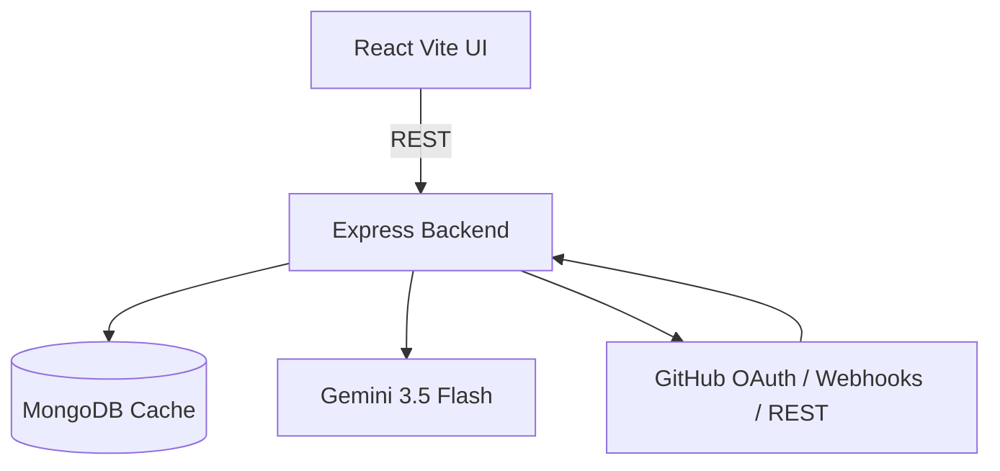

# DevTrackr

DevTrackr is an AI-powered GitHub sprint analytics dashboard. It ingests GitHub repository activity, caches structured analytics in MongoDB, and uses Gemini structured JSON outputs to produce sprint summaries, bottleneck alerts, and actionable recommendations.

## Architecture

- `backend`: Express API, GitHub OAuth, encrypted token storage, Octokit ingestion, MongoDB persistence, Gemini analysis worker, GitHub webhook invalidation.
- `frontend`: React + Vite + Tailwind dashboard with Recharts visualizations.



## Implemented flow

1. User authenticates through GitHub OAuth at `GET /api/auth/github`.
2. Backend exchanges the OAuth code for an access token and stores it encrypted with AES-256-GCM.
3. Repository metadata is synced via Octokit.
4. Analytics refresh aggregates structured activity JSON instead of raw diffs:
   - commit sha, author, timestamp, message, additions, deletions, files changed
   - PR state, comments, line deltas, changed files, cycle time
   - issue labels, state, and close velocity
5. Gemini is called from the worker/refresh path with `responseMimeType: application/json` and `responseSchema`.
6. MongoDB stores cached metrics, chart data, raw activity, AI output, and `calculatedAt`.
7. Frontend renders cached charts and insight cards instantly.

## Quick start

1. Install dependencies:

   ```bash
   npm install
   ```

2. Copy environment examples and fill in credentials:

   ```bash
   cp backend/.env.example backend/.env
   cp frontend/.env.example frontend/.env
   ```

3. Generate a strong encryption key for `TOKEN_ENCRYPTION_KEY`:

   ```bash
   openssl rand -base64 32
   ```

4. Configure a GitHub OAuth app:

   - Homepage URL: `http://localhost:5173`
   - Authorization callback URL: `http://localhost:4000/api/auth/github/callback`

5. Run development servers:

   ```bash
   npm run dev
   ```

## GitHub webhook

Point GitHub repository or organization webhooks at:

```text
POST http://localhost:4000/api/webhooks/github
```

Subscribe to `push`, `pull_request`, `issues`, and `issue_comment`. If `GITHUB_WEBHOOK_SECRET` is configured, requests are verified with `x-hub-signature-256`. Matching repositories are marked stale so the background worker can refresh cached analytics without polling aggressively.

## API summary

- `GET /health`
- `GET /api/auth/github`
- `GET /api/auth/github/callback`
- `GET /api/auth/me`
- `POST /api/auth/repositories/sync`
- `GET /api/analytics`
- `GET /api/analytics/:owner/:repo`
- `POST /api/analytics/:owner/:repo/refresh`
- `POST /api/webhooks/github`

## Validation

Run the full workspace build:

```bash
npm run build
```

The backend build performs JavaScript syntax checks. The frontend build runs Vite production compilation.
